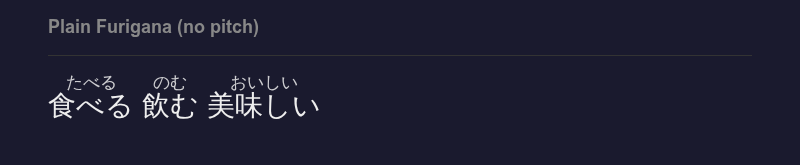
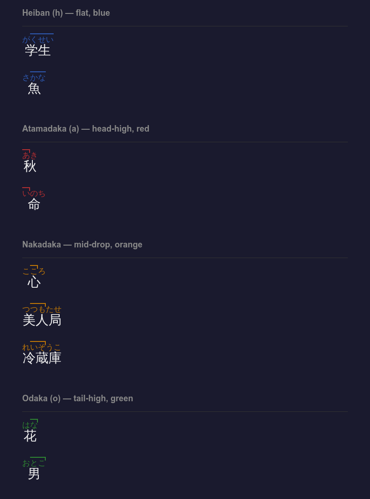
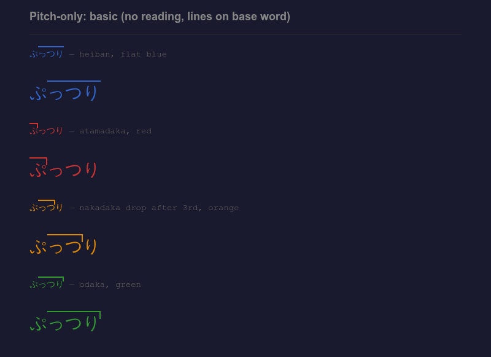
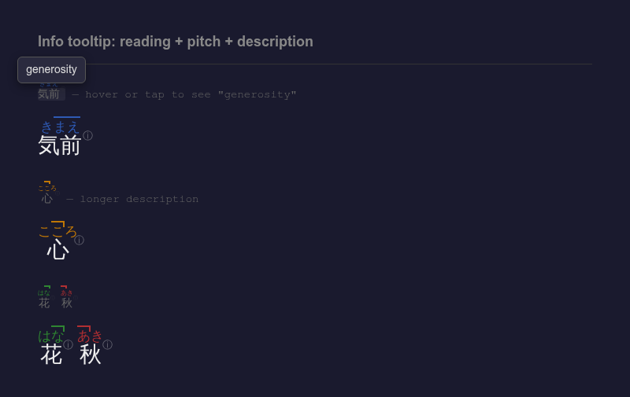
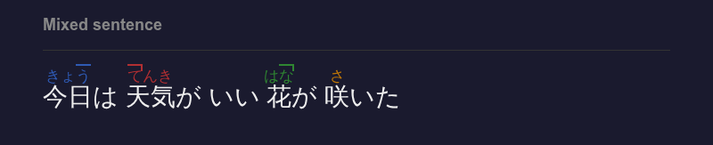

# Universal Furigana for Anki

A modern Anki add-on that converts `{annotation}` syntax into furigana, pitch accent visualization, and info tooltips — on any card, any field.

Works on **Anki Desktop**, **AnkiDroid**, and **AnkiMobile (iOS)**.

---

## Features

### Furigana

Type `word{reading}` in any card field to get furigana above the word.

```
食べる{たべる}   飲む{のむ}   美味しい{おいしい}
```



### Pitch Accent

Add a pitch code after a semicolon to visualize Japanese pitch accent with colored lines:

| Code | Type | Color | Example |
|------|------|-------|---------|
| `h` | Heiban (flat) | Blue | `学生{がくせい;h}` |
| `a` | Atamadaka (head-high) | Red | `秋{あき;a}` |
| `nX` | Nakadaka (drop after X) | Orange | `心{こころ;n2}` |
| `o` | Odaka (tail-high) | Green | `花{はな;o}` |



A **top line** marks high-pitch mora. A **vertical tick** marks where the pitch drops. The pattern is always visible — no hover needed.

### Pitch-Only Mode

Use just the pitch code without a reading — the lines are drawn directly on the base word:

```
ぷっつり{h}    ぷっつり{a}    ぷっつり{n3}    ぷっつり{o}
```



### Info Tooltips

Add a description as the last semicolon segment. It appears as a hover tooltip (desktop) or tap tooltip (mobile):

```
気前{きまえ;h;generosity}       ← reading + pitch + tooltip
食べる{たべる;;to eat}          ← reading + tooltip (no pitch)
ぷっつり{n3;snapping}           ← pitch-only + tooltip
```



A small ℹ indicator appears next to words that have a tooltip. Hover on desktop, tap on mobile. Tap elsewhere to dismiss.

### Mix Everything in a Sentence

All modes work together in the same card:



---

## Syntax Reference

| You Type | Result |
|----------|--------|
| `食べる{たべる}` | Furigana reading above word |
| `食べる{to eat}` | English text above word |
| `学生{がくせい;h}` | Reading + heiban pitch (blue) |
| `秋{あき;a}` | Reading + atamadaka pitch (red) |
| `心{こころ;n2}` | Reading + nakadaka pitch (orange) |
| `花{はな;o}` | Reading + odaka pitch (green) |
| `ぷっつり{n3}` | Pitch-only (lines on base word) |
| `気前{きまえ;h;generosity}` | Reading + pitch + ℹ tooltip |
| `食べる{たべる;;to eat}` | Reading + ℹ tooltip (no pitch) |
| `ぷっつり{n3;snapping}` | Pitch-only + ℹ tooltip |

---

## Installation

### From .ankiaddon file

1. Download `universal_furigana.ankiaddon` from this repo
2. In Anki, go to **Tools → Add-ons → Install from file...**
3. Select the downloaded file and restart Anki

### From source

1. Clone this repo
2. Copy `__init__.py`, `config.json`, and `manifest.json` into a folder inside your Anki add-ons directory (`~/.local/share/Anki2/addons21/universal_furigana/` on Linux, or find it via **Tools → Add-ons → View Files**)
3. Restart Anki

---

## Settings

Open **Tools → Universal Furigana Settings** to:

- Enable/disable the add-on
- Enable/disable pitch accent
- Customize pitch accent colors with a color picker
- Set up mobile compatibility (see below)

---

## Mobile Compatibility

The add-on works automatically on Anki Desktop. To make it work on **AnkiDroid** and **AnkiMobile (iOS)**:

1. Open **Tools → Universal Furigana Settings**
2. Scroll down to **Mobile Compatibility**
3. Check the card templates you want to enable (or click **Select All**)
4. Click **Save**
5. Sync your collection

The add-on injects the script directly into your card templates so it travels with your cards when you sync. If you change colors or settings, saving will update the injected code automatically.

---

## How It Works

- The `{annotation}` syntax stays as plain text in your card fields
- On desktop, a `card_will_show` hook injects JavaScript at render time
- For mobile, the same JavaScript is written into card templates (persists through sync)
- The JavaScript scans for `word{annotation}` patterns and replaces them with `<ruby>` elements, pitch lines, and tooltips
- Your card data is never permanently modified — uninstalling just shows the raw curly-brace syntax

---

## Uninstalling

If you uninstall the add-on:
- Your cards are **not** affected — the `{annotation}` text stays in your fields
- You'll just see the raw syntax like `食べる{たべる}` instead of rendered furigana
- To also remove injected mobile code: open settings, click **Deselect All**, then **Save** before uninstalling

---

## Author

**Eric Su** ([@reysu](https://github.com/reysu))

## License

MIT
